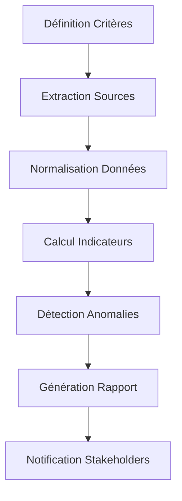
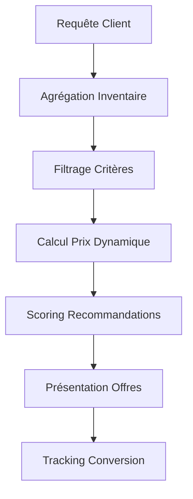
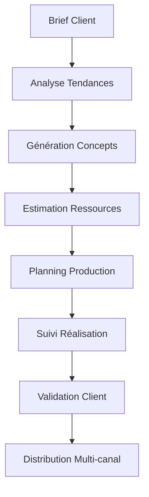

# Spécifications Fonctionnelles - Espace Métier Perplexity AI

## Vue d'ensemble
Ce document décrit en détail les règles métier, workflows, cas d'usage et scénarios opérationnels pour l'espace métier Perplexity AI avec intégration simili-programmation Python.

## Architecture Fonctionnelle

### Principes Directeurs
- **Modularité** : Composants métier indépendants et réutilisables
- **Extensibilité** : Ajout facile de nouveaux métiers sans refonte
- **Sécurité** : Isolation et contrôle d'accès granulaire
- **Performance** : Optimisation pour usage temps réel
- **Traçabilité** : Audit complet des actions et décisions

### Couches Fonctionnelles

#### Couche Présentation
- Interface utilisateur adaptée aux profils métier
- Dashboards personnalisables par rôle
- API REST pour intégrations externes
- Mobile-responsive design

#### Couche Orchestration Métier
- Engine de règles configurable
- Workflow engine pour processus complexes
- Scheduler pour tâches récurrentes
- Event sourcing pour traçabilité

#### Couche Exécution Python
- Sandbox sécurisé avec limitations ressources
- Gestionnaire de librairies whitelistées
- Runtime optimisé pour scripts métier
- Monitoring et alerting automatique

#### Couche Données et Intégrations
- Cache intelligent pour sources web
- Connecteurs APIs métier standardisés
- Data pipeline pour ETL/ELT
- Storage sécurisé configurations et résultats

## Règles Métier Génériques

### Gestion des Utilisateurs et Permissions

#### RG-001 : Authentification et Autorisation
**Règle** : Tout utilisateur doit être authentifié via SSO avant accès
- **Implémentation** : Intégration SAML/OAuth2 avec AD/LDAP
- **Exception** : API publique avec rate limiting et token
- **Contrôle** : Session timeout 8h, MFA pour admins

#### RG-002 : Séparation des Rôles
**Règle** : Les permissions sont attribuées selon le principe du moindre privilège
- **Rôles définis** :
  - **Utilisateur Métier** : Exécution scripts pré-approuvés, lecture configs
  - **Expert Métier** : Création/modification scripts, configuration règles
  - **Administrateur** : Gestion utilisateurs, déploiement, monitoring système
  - **Auditeur** : Lecture seule, accès logs et métriques

#### RG-003 : Audit Trail Obligatoire
**Règle** : Toute action modificatrice doit être tracée
- **Éléments tracés** : Qui, Quoi, Quand, Contexte, Résultat
- **Rétention** : 7 ans minimum pour conformité réglementaire
- **Format** : JSON structuré avec timestamp UTC

### Exécution Scripts Python

#### RG-004 : Validation Sécurité Scripts
**Règle** : Tout script doit passer validation sécurité avant exécution
- **Contrôles automatiques** :
  - Analyse statique AST (Abstract Syntax Tree)
  - Blacklist imports dangereux (os.system, subprocess.call, etc.)
  - Limitation complexité cyclomatique < 10
  - Scan vulnérabilités connues
- **Contrôles manuels** (scripts sensibles) :
  - Revue par expert sécurité
  - Tests penetration si accès externes
  - Validation RGPD si traitement données personnelles

#### RG-005 : Limitations Ressources Dynamiques
**Règle** : Les limitations ressources s'adaptent selon criticité et utilisateur
- **Utilisateur Standard** : 1 CPU, 512MB RAM, 30s timeout
- **Expert Métier** : 2 CPU, 2GB RAM, 5min timeout
- **Admin** : 4 CPU, 8GB RAM, 30min timeout
- **Scripts Critiques** : Ressources dédiées avec SLA 99.9%

#### RG-006 : Gestion Erreurs Intelligente
**Règle** : Erreurs doivent être interprétées et rendues compréhensibles
- **Mapping erreurs** :
  - `ImportError` → "Librairie non disponible, contactez admin"
  - `TimeoutError` → "Script trop long, optimiser ou demander extension"
  - `MemoryError` → "Données trop volumineuses, utiliser streaming"
- **Auto-recovery** : Retry automatique 3x avec backoff exponentiel
- **Escalation** : Alert admin si taux erreur > 5% sur 1h

### Intégration Sources Externes

#### RG-007 : Validation Fiabilité Sources
**Règle** : Sources web doivent être évaluées en continu
- **Critères scoring** :
  - Disponibilité (uptime) : poids 30%
  - Fraîcheur données (dernière MAJ) : poids 25%
  - Autorité domaine (domain authority) : poids 20%
  - Cohérence historique : poids 15%
  - Certification SSL/sécurité : poids 10%
- **Seuils** :
  - Score > 80% : Source fiable (cache 24h)
  - Score 60-80% : Source acceptable (cache 6h)
  - Score < 60% : Source non recommandée (warning utilisateur)

#### RG-008 : Cache Intelligent Adaptatif
**Règle** : Stratégie cache basée sur type de donnée et fréquence d'accès
- **Données temps réel** (prix, cotations) : TTL 5min
- **Données quotidiennes** (statistiques) : TTL 4h
- **Données statiques** (référentiels) : TTL 48h
- **Invalidation** : Push notification si source signale changement

## Workflows Métier Spécialisés

### Workflow : Comparateur de Prix

#### WF-PRIX-001 : Collecte et Analyse Prix


**Étapes détaillées** :
1. **Définition Critères** (Automatique/Manuel)
   - Produits à monitorer (SKU, catégories)
   - Sources concurrentes prioritaires
   - Fréquence mise à jour
   - Seuils d'alerte (variation prix > X%)

2. **Extraction Sources** (Python + API)
   - Scraping web respectueux (robots.txt)
   - Appels API partenaires/fournisseurs
   - Parsing HTML/JSON/XML selon source
   - Gestion rate limiting par source

3. **Normalisation Données** (Python pandas)
   - Standardisation formats prix (EUR/USD/etc.)
   - Nettoyage données aberrantes (outliers)
   - Enrichissement métadonnées (marque, specs)
   - Déduplication doublons

4. **Calcul Indicateurs** (Python numpy/scipy)
   - Prix moyen/médian/percentiles
   - Évolution temporelle (trend analysis)
   - Positionnement concurrentiel
   - Score compétitivité

5. **Détection Anomalies** (Python ML)
   - Algorithmes isolation forest
   - Seuils dynamiques basés historique
   - Classification anomalies (erreur vs opportunité)

6. **Génération Rapport** (Python + Templates)
   - Dashboards interactifs (Plotly/Bokeh)
   - Exports Excel pour équipes métier
   - API JSON pour systèmes tiers

7. **Notification Stakeholders** (Configurable)
   - Email/Slack alertes temps réel
   - Reports hebdomadaires automatiques
   - Webhooks vers CRM/ERP

### Workflow : Agence de Booking

#### WF-BOOK-001 : Gestion Disponibilités Dynamique


**Règles spécifiques** :
- **RG-BOOK-001** : Vérification disponibilité temps réel (<2s)
- **RG-BOOK-002** : Pricing dynamique selon demande/saison
- **RG-BOOK-003** : Overbooking controlé (max 3% selon historique)
- **RG-BOOK-004** : Annulation gratuite selon conditions partenaires

### Workflow : Management Groupe Musique

#### WF-MUSIC-001 : Production Clip Musical End-to-End


**Automatisations Python** :
- **Analyse Tendances** : Scraping charts musicaux, réseaux sociaux
- **Génération Concepts** : IA générative basée sur brief + trends
- **Estimation Ressources** : ML prédictive basée sur projets similaires
- **Planning Optimisé** : Algorithmes contraintes (resources + deadlines)
- **Monitoring Production** : Dashboards temps réel avec alertes
- **Distribution** : APIs YouTube, Spotify, TikTok, etc.

## Cas d'Usage Détaillés

### CU-001 : Analyse Concurrentielle Automatisée

**Acteur Principal** : Analyste Marketing
**Objectif** : Surveiller automatiquement positionnement concurrentiel

**Pré-conditions** :
- Comptes configurés sur plateformes cibles
- Liste concurrents validée
- Seuils d'alerte définis

**Scénario nominal** :
1. **Déclenchement** : Scheduler quotidien 08h00 ou événement externe
2. **Collecte** : Scripts Python récupèrent données multi-sources
3. **Analyse** : Algorithmes détectent changements significatifs  
4. **Reporting** : Dashboard mis à jour + notifications si seuils dépassés
5. **Actions** : Workflow décisionnel basé sur règles métier

**Scénarios alternatifs** :
- **CU-001-A** : Source indisponible → Fallback sources secondaires
- **CU-001-B** : Données incohérentes → Escalation expert humain
- **CU-001-C** : Pic de charge → Queue asynchrone + notification délai

**Post-conditions** :
- Données historisées pour analyse tendancielle
- Métriques performance collectées
- Actions recommandées documentées

### CU-002 : Optimisation Pricing Dynamique

**Acteur Principal** : Revenue Manager
**Objectif** : Ajuster prix en temps réel selon conditions marché

**Algorithme de Pricing** :
```python
def calculate_dynamic_price(base_price, demand_factor, competition_factor, 
                          seasonality_factor, inventory_level):
    """
    Calcul prix dynamique multivarié
    """
    # Facteurs de pondération métier
    weights = {
        'demand': 0.4,
        'competition': 0.3, 
        'seasonality': 0.2,
        'inventory': 0.1
    }
    
    # Calcul score composite
    composite_score = (
        demand_factor * weights['demand'] +
        competition_factor * weights['competition'] +
        seasonality_factor * weights['seasonality'] + 
        inventory_level * weights['inventory']
    )
    
    # Application multiplicateur avec bornes
    price_multiplier = max(0.7, min(2.0, composite_score))
    dynamic_price = base_price * price_multiplier
    
    return round(dynamic_price, 2)
```

## Indicateurs de Performance (KPIs)

### KPIs Techniques

#### Performance Système
- **Disponibilité** : >99.5% (SLA métier)
- **Temps réponse** : 
  - Requêtes simples : <500ms
  - Scripts Python : <30s  
  - Analyses complexes : <5min
- **Throughput** : >1000 requêtes/min
- **Taux erreur** : <0.5%

#### Qualité Code et Sécurité
- **Code coverage** : >85%
- **Vulnérabilités** : 0 critique, <5 majeures
- **Incidents sécurité** : 0 (objectif)
- **Temps résolution bugs** : <24h (critiques), <7j (mineurs)

### KPIs Métier

#### Adoption et Usage
- **Utilisateurs actifs quotidiens** : +20% MoM
- **Scripts créés par utilisateur** : >5/mois
- **Taux rétention utilisateur** : >80%
- **Score satisfaction** : >4/5

#### Impact Business  
- **ROI par fonctionnalité** : >200% sur 12 mois
- **Temps économisé** : >30% processus automatisés
- **Qualité décisions** : Réduction erreurs 50%
- **Time-to-insight** : Division par 4 vs processus manuels

### KPIs Spécialisés par Métier

#### Comparateur Prix
- **Couverture concurrentielle** : >90% parts de marché
- **Fraîcheur données** : <4h délai moyen
- **Précision prédictions prix** : >85%
- **Alertes pertinentes** : <5% faux positifs

#### Booking
- **Taux conversion** : +15% vs baseline
- **Temps réservation** : <3 min utilisateur
- **Satisfaction client** : >4.5/5 NPS
- **Optimisation yield** : +8% revenue par chambre

#### Musique/Production
- **Délai production** : -40% vs industrie
- **Précision estimations** : ±10% budget/timing
- **Taux succès projets** : >95% livrés à temps
- **ROI campagnes** : +25% vs benchmarks secteur

## Contraintes et Limitations

### Contraintes Techniques
- **Isolation** : Scripts utilisateurs ne peuvent accéder système hôte
- **Ressources** : Limitations CPU/RAM/réseau selon profil utilisateur
- **Librairies** : Whitelist sécurisée, validation avant ajout
- **Données** : Chiffrement au repos et en transit obligatoire

### Contraintes Réglementaires
- **RGPD** : Consentement explicite, droit oubli, portabilité
- **Sectorielles** : Conformité réglementations métier (finance, santé, etc.)
- **Géographiques** : Respect lois locales données transfrontalières
- **Audit** : Traçabilité complète pour contrôles externes

### Contraintes Business
- **Budget** : ROI positif sur 18 mois maximum
- **Délais** : MVP en 6 mois, fonctionnalités avancées +6 mois
- **Adoption** : 70% utilisateurs cibles actifs dans 12 mois
- **Évolutivité** : Support 10x croissance usage sans refonte majeure